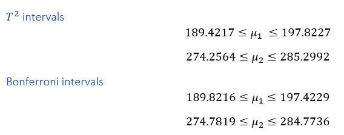

```{r global-options, echo = FALSE, eval=TRUE}
knitr::opts_chunk$set(collapse = TRUE, comment = "#>")
knitr::opts_chunk$set(fig.pos='H', fig.align='center')
```

# Question 1

```{r q1-init, echo=TRUE}
data <- read.table("../data/T1-9.dat")
names(data) <- c("country", "100m", "200m", "400m", "800m", "1500m", "3000m", "marathon")
numeric_data <- data[, -1]

countries <- as.character(data$country)
```

# a)

Consider again the data set containing National track records for women. In lab 1 we studied different distance measures between an observation and the mean vector. The most common multivariate residual is the Mahalanobis distance and we computed this distance for all 54 observations. a) The Mahalanobis distance has an approximate chi square distribution, if the data come from a multivariate normal distribution and the number of observations is fairly large. Use the approximate chi square distribution for testing each observation at significance level 0.1 %, and conclude which countries can be regarded as outliers.

```{r q1-a, echo=TRUE}
X <- as.matrix(numeric_data)
means <- colMeans(X)
covariances <- cov(X)
X_central <- X - rep(1, nrow(X)) %*% t(means)

mdist_sq <- X_central %*% solve(covariances) %*% t(X_central)
country_mdist <- diag(mdist_sq)

significance_level <- 0.001
p <- ncol(X)
quantile <- qchisq(1 - significance_level, df=p)

outliers <- country_mdist > quantile
print("Outliers without correction")
countries[outliers]

bonquantile <- qchisq(1 - significance_level / (2 * p), df=p)
paste("Critical chisquare value multiple testing corrected", round(bonquantile, 4))
outliers_bon <- country_mdist > bonquantile
print("Outliers with correction")
countries[outliers_bon]
```

Here are the countries that can be regarded as outliers since their Mahalanobis distance is greater than the critical set chi square distribution as `r quantile`. The countries are North Korea, Papa New Guinea and Samoa Island.

Using a significance level as low as 0.1 % makes it easy for a type 2 error – that is, when the null hypothesis is false and we do not reject it. We only believe there to be 0.1 % probability of random error and that is quite low.

If we use the multiple-testing correction we get the critical value as `r bonquantile` and the country that has a greater value than this is only Samoa Island. By using the multiple-testing correction we get a much smaller significance level since we divide the significance level by 2 * p (2*7). We already have a very low significance level set to 0.1 %, dividing that small number will increase the probability of a type 2 error.

# b)

When using the Mahalanobis distance it takes the co-variances into account where the Euclidean distance assumes equal variance of the variables and zero covariates, skipping out on a lot of valuable information. Euclidean distance is not an ideal measurement to use in this dataset since the variables has very different units (e.g the time for 100 meter and marathon varies greatly).

\newpage

# Question 2

## a)

```{r q2-a}
bird <- read.table("../data/T5-12.DAT")

mu <- c(190, 275)  #mus
x_bar <- colMeans(bird)
S <- cov(bird)
angles <- seq(0, 2 * pi, length.out=200) # make angles for circle

n <- nrow(bird)
p <- ncol(bird)

confidence_level <- 0.05

## eigenvalues and eigvactors from covariance matrix S
eigVal  <- eigen(S)$values
eigVec  <- eigen(S)$vectors

quantile <- qf(1 - confidence_level, df1=p, df2=n - p)
scale <- sqrt(eigVal * p * (n - 1) * quantile / (n * (n - p)))

scaled  <- eigVec %*% diag(scale)  # scale eigenvectors to length = square-root

xMat    <- rbind(x_bar[1] + scaled[1, ], x_bar[1] - scaled[1, ])
yMat    <- rbind(x_bar[2] + scaled[2, ], x_bar[2] - scaled[2, ])
ellBase <- cbind(scale[1]*cos(angles), scale[2]*sin(angles)) # making a circle base...

ellax  <- eigVec %*% t(ellBase) # where the ellips axis goes through eigenvectors.
plot(bird, lwd="4", xlab="Tail length", ylab="Wing length", xlim=c(185, 200), ylim=c(270, 290))
lines((ellax + x_bar)[1, ], (ellax + x_bar)[2, ], asp=1, type="l", lwd=2, col="blue")
matlines(xMat, yMat, lty=1, lwd=2, col="green")  #
points(mu[1], mu[2], pch=4, col="red", lwd=3)
grid()
points(mean(bird[,1]),mean(bird[,2]), type="p", col="red", pch=15)
```

Since the male mean (red cross) is inside the confidence region we do not reject the hypothesis that males and females have the same mean.

## b)

```{r q2-b, echo=TRUE}
compute_tsq_intervals <- function(data, confidence=0.05) {
    n <- nrow(data)
    p <- ncol(data)
    x_bar <- colMeans(data)
    S <- cov(data)

    offset <- sqrt(p * (n - 1) * qf(1 - confidence, df1=p, df2=n - p) / (n - p) * diag(S) / n)
    rbind(x_bar - offset, x_bar + offset)
}

compute_bonferroni_intervals <- function(data, confidence=0.05) {
    n <- nrow(data)
    p <- ncol(data)
    x_bar <- colMeans(data)
    S <- cov(data)

    offset <- sqrt(diag(S) / n) * qt(1 - confidence / (2 * p), df=n - 1)
    rbind(x_bar - offset, x_bar + offset)
}

tsq_intervals <- compute_tsq_intervals(bird, confidence_level)
bon_intervals <- compute_bonferroni_intervals(bird, confidence_level)
```



T-square test always gives wider confidence intervals since it takes the correlation between the measured variables into account. Bonferroni intervals are more precise if you are interested in the individual component means, but if you are interested in the overall data mean you should consider the T-square intervals.

## c)

```{r g2-c, echo=TRUE}
library(car)

dataEllipse(x=bird$V1, y=bird$V2, pch=20, levels=c(0.68, 0.95),
            xlim=c(160, 230), ylim=c(240, 320), center.cex=0.5)

old <- par(mfrow=c(1, 3))
qqplot(bird$V1, bird$V2, pch=20)
qqnorm(bird$V1, pch=20)
qqline(bird$V1)
qqnorm(bird$V2, pch=20)
qqline(bird$V2)
par(old)
```

A bivariate normal distribution would be a viable population model. The qqplots do not deviate to much from the straight lines and the scatter plot shows that the points could very well have been generated from a bivariate normal distribution.

\newpage

# Question 3

```{r q3-init, echo=TRUE}
library(heplots)
library(dplyr)
library(ggplot2)
library(reshape2)

data <- Skulls
numeric_data <- data[, -1]
colors <- as.numeric(data$epoch)
```

# a)

```{r q3-a, echo=TRUE}
# pairs(numeric_data, col=colors)
mm <- melt(data, id="epoch")
ggplot(mm) +
    geom_boxplot(aes(x=factor(epoch), y=value, fill=variable))
```

# b)

```{r q3-b}
group_means <- data %>%
    group_by(epoch) %>%
    summarise_all(funs(mean(., na.rm=TRUE)))

print("Group means")
group_means

fit <- manova(cbind(mb, bh, bl, nh) ~ data$epoch, data)
summary(fit)
```

If there is more than one dependent variable, you can test them simultaneously using a multivariate analysis of variance MANOVA. Here is the summary for the manova model using the Pillai’s trace as test statistic. There are 3 other test statistics in R but Pillai is considered to be the most reliable of them all and also offers the greatest protection against Type I errors with small sample sizes. Pillai's trace is the sum of the variance which can be explained by the calculation of discriminant variables. It calculates the amount of variance in the dependent variable which is accounted for by the greatest separation of the independent variables.

Since the P-value is smaller than 0.05, we reject the hypothesis that the mean between the epochs are equal.

```{r}
print("T-square Confidence Intervals")
compute_tsq_intervals(numeric_data)
```

```{r}
X <- as.matrix(data[,2:5])
y <- as.factor(data[,1])

old <- par(mfrow=c(2,2))

compareX1 = aov(X[,1] ~ y)
plot(TukeyHSD(compareX1))

## TukeyHSD(compareX1)$y[2,]

compareX2 = aov(X[,2] ~ y)
plot(TukeyHSD(compareX2))

compareX3 = aov(X[,3] ~ y)
plot(TukeyHSD(compareX3))

## TukeyHSD(compareX3)$y[2,]

compareX4 = aov(X[,4] ~ y)
plot(TukeyHSD(compareX4))

par(old)
```

# c)

```{r g3-c, echo=TRUE}
residuals <- fit$res
col_names <- c("mb", "bh", "bl", "nh")

old <- par(mfrow=c(2, 2))

for (col in 1:ncol(residuals)) {
    x <- residuals[, col]
    main <- col_names[col]
    h <- hist(x, breaks=25, main=main)
    offset <- (max(x) - min(x)) / 2
    xfit <- seq(min(x) - offset, max(x) + offset, length = 100)
    yfit <- dnorm(xfit, mean = mean(x), sd = sd(x))
    yfit <- yfit * diff(h$mids[1:2]) * length(x)
    lines(xfit, yfit, col="blue", lwd=2)
}

par(old)
```

\newpage

# Appendix

## Code

```{r, eval=FALSE}
# Question 1
<<q1-init>>
<<q1-a>>
<<q1-b>>

# Question 2
<<q2-init>>
<<q2-a>>
<<q2-b>>
<<q2-c>>

# Question 3
<<q3-init>>
<<q3-a>>
<<q3-b>>
<<q3-c>>
```
